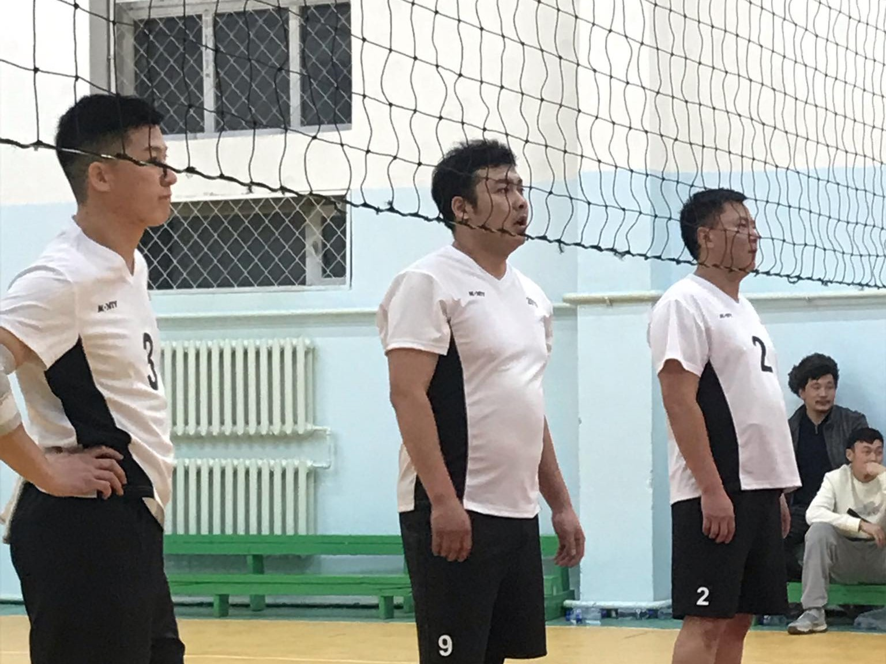

<!-- Typing animation -->

  

## 👨‍💻 About Me

- 🎓 Graduated from <a href="https://www.must.edu.mn/en/">Mongolian University of Science and Technology</a>  
- 💼 5 years of IT experience: installing and building IT devices etc.  
- 🌱 Studying Japanese (JLPT N2)  
- 🌐 Building learning platforms for full-stack developers  
- 🛠️ in progress Mining Engineer & Full-Stack Developer  

---

## 🛠️ Tech Stack / Learning

### 💻 Frontend

### ⚙️ Backend & Hosting

---

## 🌍 Featured Projects

| Project | Description |
|--------|-------------|
| [🧠 Mongolian Historical Page](http://mongolia.it.com) | Brief historical overview of Mongolia |
| [🏗 Dynamic Homepage](https://github.com/bekrisan) | Building a learning platform |

---

## 📈 GitHub Stats

  
   
  
   
  

---

## 🏆 Hobbies

  <figure style="max-width: 600px; margin: 0 auto;">
    
    <figcaption>Picture of the 2023 High School Volleyball Championship</figcaption>
  </figure>
   
  <figure style="max-width: 600px; margin: 0 auto;">
    
    <figcaption>Volleyball World Championship — Brazil vs France</figcaption>
  </figure>
   
  <figure style="max-width: 600px; margin: 0 auto;">
    
    <figcaption>Hiking with family</figcaption>
  </figure>

---

## 💼 Experience

- IT Support & Systems (5 years): server setup, network devices, troubleshooting  
- Web Development: React, Node.js, Express, PostgreSQL  
- DevOps Basics: deployment on Vercel, CI/CD for small projects

---

## 📫 Contact

  <a href="http://mongolia.it.com/about">About</a>
  &nbsp;•&nbsp;
  

